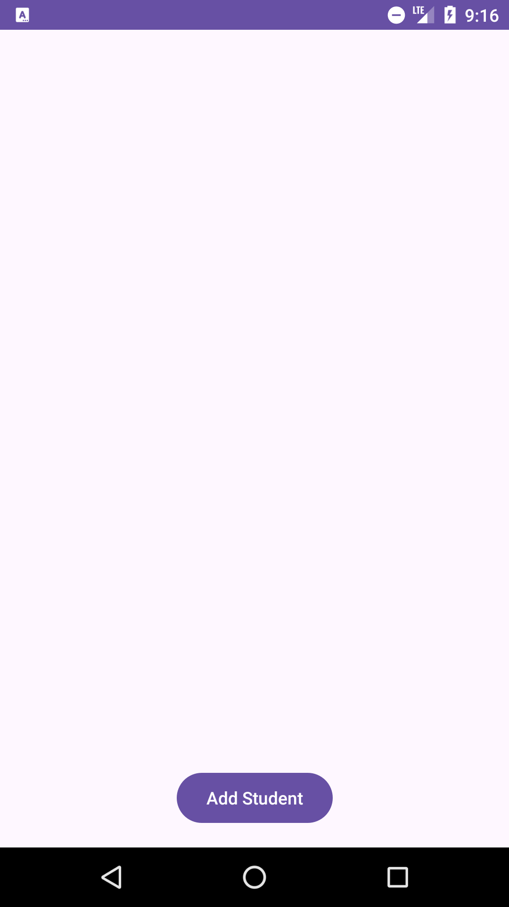
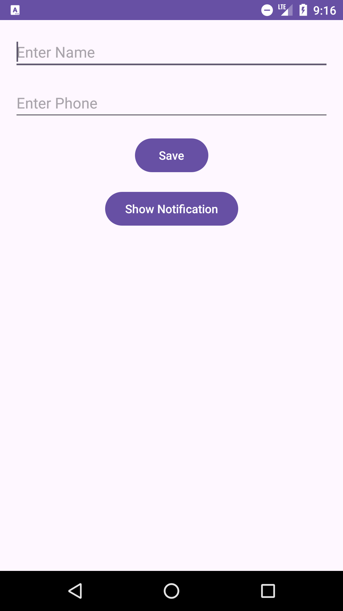
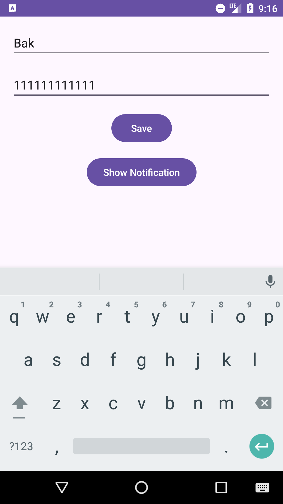
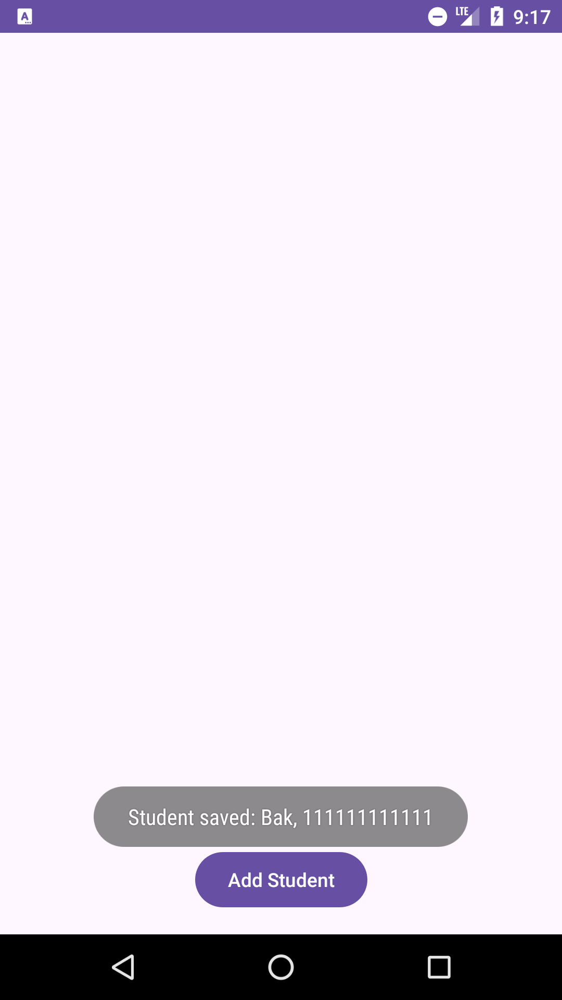
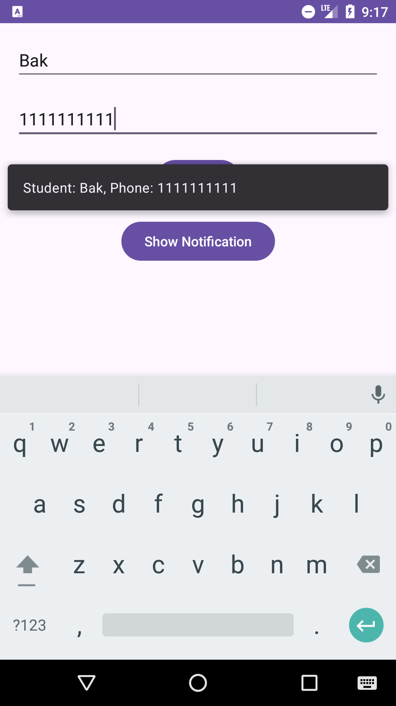

# University App - Android

Цей додаток для Android дозволяє додавати студентів, зберігати їх дані, а також відправляти SMS повідомлення через зовнішній додаток для SMS. Крім того, реалізовано показ push-подібного повідомлення в самому додатку через **`Toast`**.

## Опис

### Основні функції:
1. **Додавання студентів:**
    - Користувач може ввести ім'я студента та його телефонний номер.
    - Дані зберігаються при натисканні на кнопку "Save", після чого з'являється повідомлення про успішне збереження.

2. **Відправка SMS:**
    - Додаток дозволяє відправити SMS через зовнішній додаток на вказаний номер телефону.
    - Після відправки SMS відображається повідомлення у вигляді **`Snackbar`** або **`Toast`**, що підтверджує успішну відправку.

3. **Push-подібні повідомлення:**
    - Додано кнопку "Show Notification", яка показує **`Toast`** повідомлення у верхній частині екрану, яке містить дані, введені користувачем.
    - Повідомлення з'являється на 10 секунд після натискання кнопки.

## Інтерфейс

### Головний екран
- Поле для введення імені студента.
- Поле для введення номера телефону студента.
- Кнопка **`Save`** для збереження даних студента.
- Кнопка **`Show Notification`** для показу push-подібного повідомлення в самому додатку.
- Список студентів, де можна натискати на кожного студента для відправки SMS.

### Вікно додавання/редагування студента
- Форма для введення ім'я та телефону студента.
- Кнопка **`Save`** для збереження введених даних.

### Повідомлення
- Після натискання на **`Show Notification`**, на екрані з'являється повідомлення, яке показує дані студента. Плашка з повідомленням з'являється на 10 секунд у верхній частині екрана.

## Технології

- **Мова програмування**: Kotlin
- **Інтерфейс**: Android SDK
- **Залежності**:
   - AndroidX
   - Google Material Components для **`Snackbar`** та **`Toast`**

## Додаткові налаштування

1. У **`AndroidManifest.xml`** додано дозвіл на відправку SMS:
    ```xml
    <uses-permission android:name="android.permission.SEND_SMS" />
    ```

2. Для показу **`Snackbar`** та **`Toast`** використовуються стандартні методи Android.

## Відомі проблеми

- **Snackbar** може бути обмежений в деяких випадках через політику доступу до внутрішніх класів бібліотеки Material.
- **Toast** використовувався як простий спосіб для відображення повідомлень замість **`Snackbar`** для спрощення реалізації push-подібного повідомлення.

## Головний екран


## Головний екран 2

## Введення даних

## Зберігання даних

## Відправка смс
